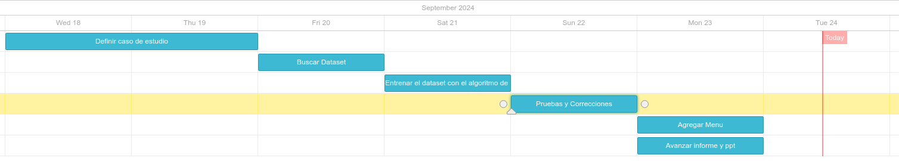

# Random Forest Diabetes Classifier

Este proyecto implementa un clasificador de diabetes utilizando un bosque aleatorio (Random Forest). El programa entrena el modelo usando un conjunto de datos de diabetes, luego lo evalúa y permite realizar pruebas con datos específicos.

## Diagrama de Gantt



## Estructura del Proyecto

- **`test.go`**: Archivo principal que carga el conjunto de datos de diabetes, entrena el modelo y realiza la evaluación.
- **`RF`**: Carpeta que contiene la implementación del modelo de Random Forest y los árboles de decisión.

## Requisitos

- Go (Golang) instalado en tu sistema.
- El archivo de datos `diabetesV3.csv` en el mismo directorio que el programa.

## Instalación

1. Clona el repositorio:
    ```bash
    git clone https://github.com/joyel124/RF_GO.git
    cd RF_GO
    ```

2. Asegúrate de que tienes el archivo `diabetesV3.csv` en el mismo directorio del proyecto. Este archivo debe contener las características y etiquetas para el entrenamiento del modelo.

## Ejecución

Puedes ejecutar el programa principal usando el comando:

```bash
go run test.go